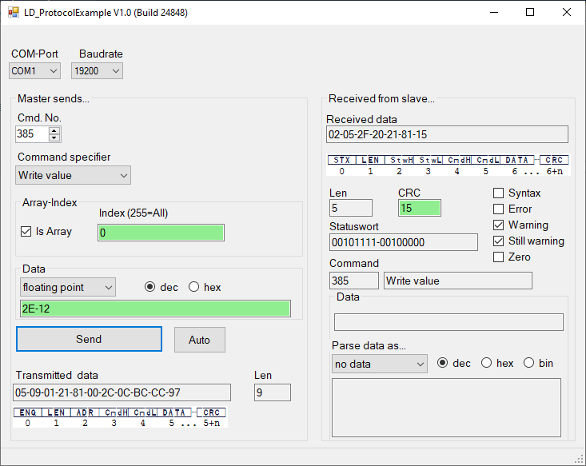

# LD_ProtocolExample

This is an example Windows application for INFICON's LD serial interface protocol.

LD protocol is supported by the following INFICON products (Last update: September 2020)
* LDS3000 / LDS300AQ
* XL3000flex
* Contura S400
* ELT3000
* UL3000 Fab Series
* HLD6000

This example program is written in C# using Visual Studio 2017

With this program you can
* Send a LD telegram via serial port to the leakdetector by entering LD command number, Command specifier and user data.
* Receive the result fromm the leak detector and parse data depending on the data type.

The executable program can be found at 

    LD_ProtocolExample\bin\Debug\LD_ProtocolExample.exe
    
Feel free to use this source code as template for your own applications.

## Source code core functions

### Sending data telegram to the leak detector:

Composition of the telegram (ENQ, Address, user data,CRC). Refer to function: 

    GenerateSendData()

### Receiving data from leak detector:
For low-level communication (wait for STX, parse length byte, check CRC) refer to function

    serialPort_DataReceived(...)
  
For high-level parsing (statusword, user data ...) please refer to function

    private void DoUpdate(object s, EventArgs e)

    

